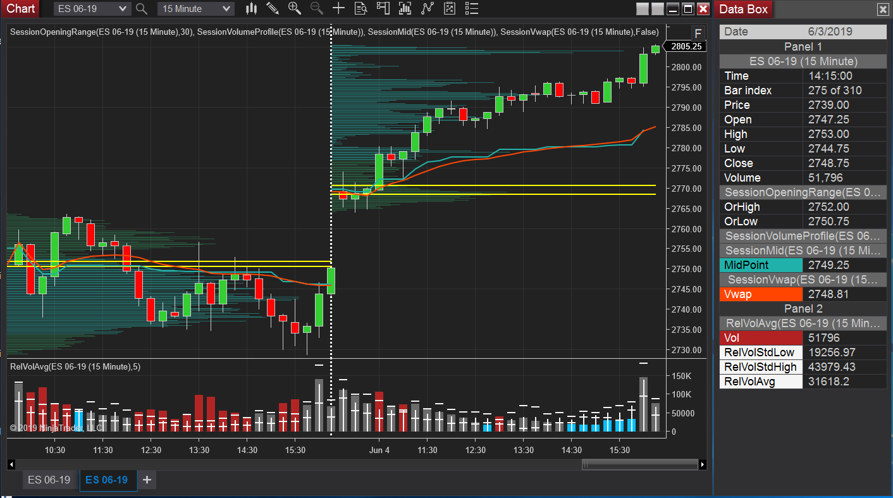

# NinjaTrader
NinjaTrader 8 Indicators

SessionMid - Indicator for sessions Mid Point ((Session High + Session Low) / 2)

SessionOpeningRange - Session’s Hi-Low opening range specified in seconds from session open

SessionVwap – Session’s Volume Weighted Average Price calculated from trade ticks

SessionVolProfile – Session's Volume for each price traded.  Value Area is included.

RelativeVolume - Average volume at time period with Standard Deviation Marks.
