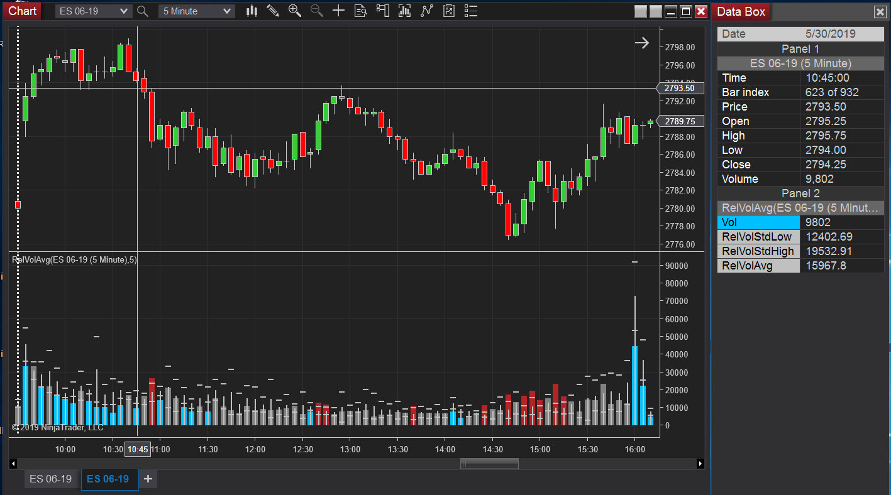

# Average Relative Volume Indicator : Ninjatrader 8 Indicator that displays average volume at bar time period

Wide colored bars are bar's volume, color coded against average relative volume standard deviation.  In Image:
#### Red Bar - 1 standard deviation above average relative volume
#### Grey Bar - Within 1 standard deviation of average relative volume
#### Blue Bar - 1 standard deviation below average relative volume

#### White horizontal hask marks - +/- 1 standard deviation of relative volume average
#### White vertical line - average relative volume

## Author

Michel McDonald
