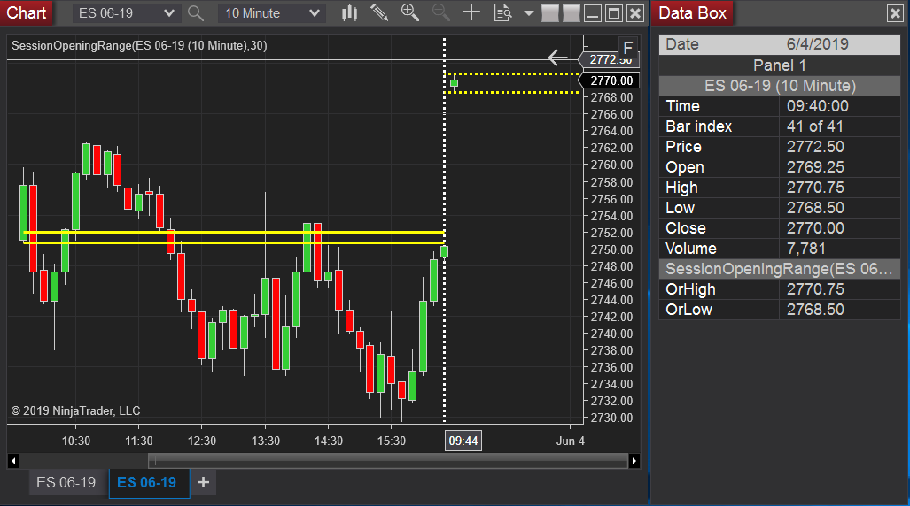

# Session Opening Range Indicator : Ninjatrader 8 Indicator to display Hi and Low Opening Range

Solid Line indicates Opening Range is complete, Dashed Line indicates Opening Range is in progress
### Requires Tick Data
### Range is specified in seconds after session open(Properties::Parameters::CutoffSeconds)
### Customise Hi-Low Line Color and Width

### Works with any bar time period
### Updates in realtime as range is forming

## Author

Michel McDonald
